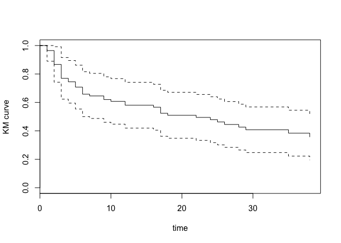

<!-- README.md is generated from README.Rmd. Please edit that file -->
README
------

This package approaches simultaneous confidence bands for survival functions purely from an optimization perspective: given a certain coverage level, obtain bands such that the area between is minimized. This is achieved through an approximate solution based off local time arguments for both the survival and cumulative-hazard functions.

Installation
------------

``` r
install.packages("devtools", repos="http://cran.rstudio.com/")
library(devtools)
devtools::install_github("seasamgo/optband")
library(optband)
```

Methods
-------

``` r
opt.ci(
  survi,              # object of class 'survfit'
  conf.level = 0.95,  # confidence level
  fun = 'surv',       # time-to-event function ('surv' or 'cumhaz')
  tl = NA,            # truncation lower bound
  tu = NA,            # truncation upper bound
  samples = 1         # 1 or 2 sample case
  )
```

`opt.ci` takes a `survfit` object from the survival package as input and returns a `survfit` object with confidence bands for the specified time-to-event function (e.g. the two-sample cumulative hazard difference function). Additional optional parameters include the confidence level 1 − *α*, optional upper or lower bounds for data truncation, and the number of samples to consider (1 or 2).

Please view the corresponding help files for more.

Example
-------

Obtain minimal-area confidence bands for bladder cancer data from the `survival` package:

``` r
library(survival)

## 1-sample case
dat <- bladder[bladder$enum==1,]
s <- survival::survfit(Surv(stop, event) ~ 1, type = "kaplan-meier", data = dat)
optband_s <- optband::opt.ci(s)
plot(optband_s, xlab = "time", ylab = "KM curve", mark.time = FALSE)
```


